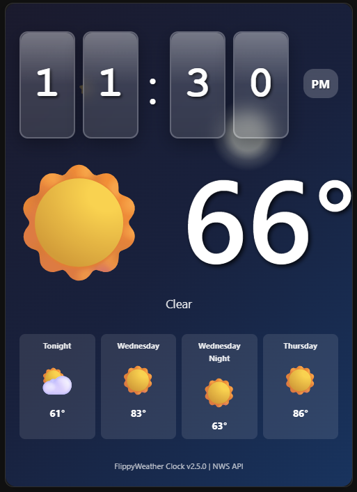

# 🌤️ FlippyWeather Clock Testing

## Screenshots

### Day Mode


### Night Mode  


A modern, animated flip clock weather card for Home Assistant. Features beautiful flip animations, real-time weather forecasting, dynamic animated backgrounds, and extensive customization options that change based on weather conditions and time of day.

   

## ✨ Features

- 🕐 **Animated Flip Clock** - Large, smooth digit animations with 5 size options (small to huge)
- 🌦️ **Weather Integration** - Real-time weather data from Home Assistant weather entities
- 🎨 **Dynamic Animated Backgrounds** - Weather-responsive backgrounds with day/night modes
- 🌙 **Automatic Night Mode** - Darker themes between 8 PM and 6 AM
- 📦 **Self-Contained** - No external files or dependencies required
- 📱 **Fully Responsive Design** - Works perfectly on all screen sizes and dashboard layouts
- ⚡ **Modern Performance** - Pure vanilla JavaScript, no jQuery
- 🎯 **Extensive Customization** - Independent sizing for clock, temperature, and date
- 🎨 **5 Beautiful Themes** - Default, Dark, Light, Sunset, and Ocean
- 🔧 **YAML-Only Configuration** - No complex visual editor, reliable setup

## 🆕 Version 4.x New Features

### 🎛️ **Complete Size Control**
- **Clock Size**: 5 options from small to huge (vertical scaling only - no overflow!)
- **Temperature Size**: Independent sizing from small to huge
- **Date Size**: 4 size options from small to extra-large
- **Icon Opacity**: 5 levels from hidden to full visibility

### 📱 **Advanced Responsive Design**
- **Container Queries**: Automatically adapts to narrow dashboard layouts
- **Anti-Overflow Protection**: Text never gets cut off, scales intelligently
- **3-Column Dashboard Support**: Perfect layout in narrow columns
- **Mobile Optimization**: Automatic vertical layout on small screens

### 🎨 **Enhanced Customization**
- **Compact Mode**: Vertical layout option for space-saving
- **Show/Hide Options**: Toggle date and condition display independently
- **Text Effects**: Optional shadows and blur effects
- **Position Control**: Date repositioned to bottom to avoid clock interference

## 🎬 Animated Weather Backgrounds

The card features beautiful animated backgrounds that automatically change based on current weather conditions:

### ☀️ Day Mode Animations
- **Sunny**: Warm gradients with pulsing sun glow effects
- **Rainy**: Blue tones with animated falling rain effects
- **Snowy**: Winter colors with floating snowflakes
- **Cloudy**: Overcast grays with drifting cloud overlays
- **Stormy**: Dark themes with lightning flash effects
- **Foggy**: Muted colors with wavy mist effects

### 🌙 Night Mode Animations (8 PM - 6 AM)
- **Clear Night**: Deep navy with glowing moon and twinkling stars
- **Rainy Night**: Dark blues with subtle rain effects
- **Snowy Night**: Dark grays with bright, visible snowflakes
- **Cloudy Night**: Darker storm clouds with muted movements
- **Stormy Night**: Near-black backgrounds with blue lightning
- **Foggy Night**: Dark grays with gentle mist effects

## 🚀 Installation

### 🎯 Option A: Install via HACS (Recommended)

1. 🏠 **Open HACS** in Home Assistant
2. 🎨 Go to **Frontend** section
3. ⚙️ Click the menu (⋮) → **Custom Repositories**
4. 📝 Add repository URL: `https://github.com/cnewman402/flippyweather-clock-testing`
5. 📂 Select category: **Dashboard**
6. ⬇️ Click **Add** → **Install** → **Download**
7. 🔄 **Restart Home Assistant**
8. 🧹 Clear browser cache (Ctrl+F5)

### 📁 Option B: Manual Installation

1. 💾 Download `flippyweather-clock-testing.js` from this repository
2. 📂 Place it in `/config/www/flippyweather-clock-testing/`
3. ⚙️ Go to **Settings** → **Dashboards** → **Resources** → **Add Resource**:
   - 🔗 **URL**: `/local/flippyweather-clock-testing/flippyweather-clock-testing.js`
   - 📄 **Type**: JavaScript Module
4. 🔄 **Restart Home Assistant**
5. 🧹 Clear browser cache (Ctrl+F5)

## ⚙️ Configuration

Configure using YAML only - no complex visual editors needed! All options are optional with sensible defaults.

## 🎴 Card Configuration

### 🎯 Basic Example
```yaml
type: custom:flippyweather-clock-testing
weather_entity: weather.home
```

### 🎨 Full Customization Example
```yaml
type: custom:flippyweather-clock-testing
weather_entity: weather.home
theme: ocean
temperature_unit: fahrenheit
am_pm: true
compact_mode: false
show_date: true
show_condition: true
clock_size: large
temperature_size: extra-large
date_size: medium
text_shadow: true
blur_background: true
icon_opacity: medium
animated_background: true
```

### 📱 Compact Mobile-Friendly Setup
```yaml
type: custom:flippyweather-clock-testing
weather_entity: weather.home
compact_mode: true
clock_size: small
temperature_size: medium
date_size: small
show_date: false
icon_opacity: low
```

### 🎯 Large Desktop Display
```yaml
type: custom:flippyweather-clock-testing
weather_entity: weather.home
theme: sunset
clock_size: huge
temperature_size: huge
date_size: large
am_pm: true
icon_opacity: high
```

## 📋 Configuration Options

| Option | Type | Default | Description | Values |
|--------|------|---------|-------------|---------|
| **`weather_entity`** | string | `null` | **Required** - Your HA weather entity | `weather.home`, etc. |
| **`theme`** | string | `'default'` | Color scheme | `default`, `dark`, `light`, `sunset`, `ocean` |
| **`temperature_unit`** | string | `'fahrenheit'` | Temperature display | `fahrenheit`, `celsius` |
| **`am_pm`** | boolean | `false` | 12-hour format with AM/PM | `true`, `false` |
| **`compact_mode`** | boolean | `false` | Vertical layout for small spaces | `true`, `false` |
| **`show_date`** | boolean | `true` | Show full date display | `true`, `false` |
| **`show_condition`** | boolean | `true` | Show weather condition text | `true`, `false` |
| **`clock_size`** | string | `'medium'` | Clock digit size | `small`, `medium`, `large`, `extra-large`, `huge` |
| **`temperature_size`** | string | `'medium'` | Temperature display size | `small`, `medium`, `large`, `extra-large`, `huge` |
| **`date_size`** | string | `'medium'` | Date text size | `small`, `medium`, `large`, `extra-large` |
| **`text_shadow`** | boolean | `true` | Text shadow effects | `true`, `false` |
| **`blur_background`** | boolean | `true` | Backdrop blur on clock digits | `true`, `false` |
| **`icon_opacity`** | string | `'medium'` | Weather icon transparency | `hidden`, `low`, `medium`, `high`, `full` |
| **`animated_background`** | boolean | `true` | Weather-based animations | `true`, `false` |

## 🎨 Theme Gallery

### 🌊 **Ocean Theme**
Beautiful blue-green gradients perfect for coastal vibes

### 🌅 **Sunset Theme** 
Warm orange and pink gradients for golden hour feels

### 🌑 **Dark Theme**
Sleek dark grays for modern minimalist setups

### ☀️ **Light Theme**
Clean whites and grays for bright, airy dashboards

### 🎨 **Default Theme**
Classic blue gradients with automatic night mode

## 📱 Responsive Design Features

### 🏗️ **Smart Layout Switching**
- **Wide screens**: Horizontal layout with clock left, weather right
- **Narrow screens**: Automatic vertical layout, center-aligned
- **3-column dashboards**: Perfect scaling without overflow

### 📐 **Intelligent Sizing**
- **`clamp()` functions**: Responsive sizing that scales with viewport
- **Container queries**: Layout adjusts based on card width, not screen width
- **Overflow protection**: Text shrinks rather than getting cut off

### 🎯 **Breakpoint Optimization**
- **450px+**: Full horizontal layout
- **350px-449px**: Compressed spacing, smaller text
- **280px-349px**: Vertical layout, center alignment
- **<280px**: Maximum compression with readable text

## 🌦️ Weather Data Source

This card uses **Home Assistant weather entities** which:
- 🎯 Works with any weather integration (OpenWeatherMap, AccuWeather, etc.)
- 🏠 Uses your existing HA weather setup
- 🔄 Updates automatically with your weather integration
- 📅 Shows current conditions with emoji icons
- 🔑 No additional API keys required

## 🔧 Technical Details

### 🗃️ Modern Architecture
- ⚡ **No jQuery dependency** - Lightweight and fast
- 📦 **Self-contained component** - All CSS and logic in one file
- 🌤️ **Home Assistant weather entities** - Uses your existing setup
- 🎨 **CSS3 animations** - Hardware-accelerated flip transitions
- 🚀 **Modern JavaScript** - ES6+ with proper error handling
- 🌙 **Intelligent time detection** - Automatic day/night switching
- 📱 **Container queries** - True responsive design

### 🚀 Performance Benefits
- ⚡ **Faster loading** - No external dependencies
- 💾 **Better memory usage** - Efficient LitElement implementation
- 🎬 **Hardware-accelerated animations** - CSS transforms for smooth effects
- 📱 **Responsive design** - Container queries and flexbox layouts
- 🧠 **Smart resource usage** - Animations only when beneficial

## 🌐 Browser Compatibility

Works with all modern browsers that support:
- ⚙️ ES6 JavaScript features
- 🎨 CSS Custom Properties and Container Queries
- 📐 CSS Grid and Flexbox
- 🧩 Web Components (LitElement)
- 🎬 CSS Animations and Transforms

## 🔧 Troubleshooting

### ❌ Card doesn't appear
- 🎯 **HACS**: Verify resource path includes `flippyweather-clock-testing`
- 📁 **Manual**: Verify correct file path in resources
- 🧹 Clear browser cache (Ctrl+F5)
- 🐛 Check browser console for JavaScript errors
- 🔄 Ensure Home Assistant restart after installation

### 🌤️ Weather data not loading
- 📝 Verify `weather_entity` matches your actual weather entity ID
- ⚙️ Check that your weather integration is working in HA
- 🌐 Ensure weather entity provides temperature and state data
- 🐛 Check browser console for entity error messages

### ⏰ Time not updating
- ⚙️ Card uses browser time automatically
- 🧹 Clear browser cache and reload
- 🔄 Restart Home Assistant if needed

### 🎬 Animations not working
- 🧹 Clear browser cache completely
- 🎨 Verify browser supports CSS transforms
- 🐛 Check for JavaScript errors in console
- ⚙️ Ensure `animated_background: true`

### 📱 Text getting cut off
- 📝 Use smaller size options (`small` or `medium`)
- 🎨 Try `compact_mode: true` for narrow spaces
- 📐 Check your dashboard column layout
- 🔄 Refresh page after config changes

### 🌙 Night mode not activating
- 🕐 Night mode: 8 PM to 6 AM local browser time
- 🌍 Uses your browser's timezone
- 🔄 Refresh if time recently crossed threshold

## 📝 Version History

**v4.10.0** - Latest (Testing)
- 🎛️ Added independent temperature size control
- 📐 Enhanced responsive design with container queries
- 🛡️ Improved overflow protection for all screen sizes
- 🎨 Better spacing and gap management
- 📱 Optimized for 3-column dashboard layouts

**v4.9.0** - Previous
- 🎯 Added comprehensive size options for all elements
- 📍 Repositioned date to bottom to avoid clock interference
- 🎨 Added icon opacity controls
- 📱 Implemented aggressive responsive breakpoints
- 🔧 YAML-only configuration (removed problematic visual editor)

**v4.0.0** - Major Update
- 🎨 Complete responsive redesign
- 📐 Added clock, temperature, and date sizing options
- 🌈 Enhanced theme system
- 🎛️ Added compact mode and display toggles
- 📱 Container query support for true responsive design

**v2.5.0** - Previous Stable
- 🎨 Dynamic animated weather backgrounds
- 🌙 Automatic day/night mode switching
- 📱 Enhanced responsive design
- 🎬 Weather-responsive background animations

## 🤖 Development

This card was created entirely using [Claude.ai](https://claude.ai) by Anthropic through an iterative development process spanning multiple chat sessions.

**Development Highlights:**
- 🧠 **AI Assistant**: Claude Sonnet 4 (Pro subscription)
- 💻 **Development Process**: Collaborative problem-solving with AI
- 🔧 **Technologies**: LitElement, CSS3, Container Queries, ES6+
- 🎯 **Methodology**: Issue identification → Solution → Fresh code iterations
- 📱 **Focus**: Responsive design and user experience

The entire codebase evolved from a simple clock with overflow issues to a fully-featured, responsive weather card through systematic improvements and fresh code generations. This showcases the potential for AI-assisted development in creating polished, production-ready Home Assistant integrations.

## 📄 License

This project is licensed under the MIT License.

## 🤝 Contributing

Contributions are welcome! Please feel free to submit a Pull Request.

## 💬 Support

If you encounter issues:
1. 📖 Check the troubleshooting section above
2. 🐛 Open an issue on GitHub with:
   - 🏠 Your Home Assistant version
   - 🌐 Browser and version
   - ❌ Any console error messages
   - ⚙️ Your complete card configuration
   - 📱 Screen size/dashboard layout if layout-related
   - 🌤️ Weather entity details if weather-related

## 🙏 Credits

- 📱 Inspired by classic flip clock designs
- 🌤️ Weather data from Home Assistant integrations
- 🏠 Built for the Home Assistant community
- 🤖 Developed with [Claude.ai](https://claude.ai) by Anthropic
- 🎨 Modern responsive design principles
- 📐 Container query implementation for true responsive cards

---

**Enjoy your FlippyWeather Clock with complete customization control! 🌤️⏰✨**

*Perfect for any dashboard layout - from single column mobile to triple column desktop!* 📱💻
